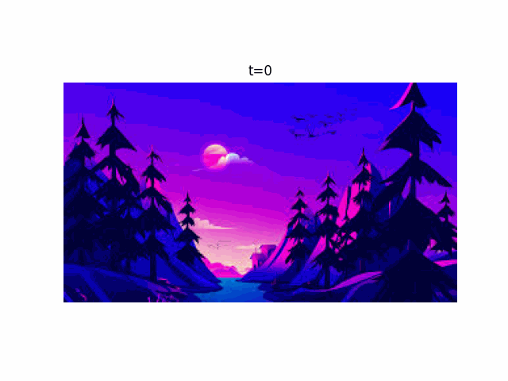
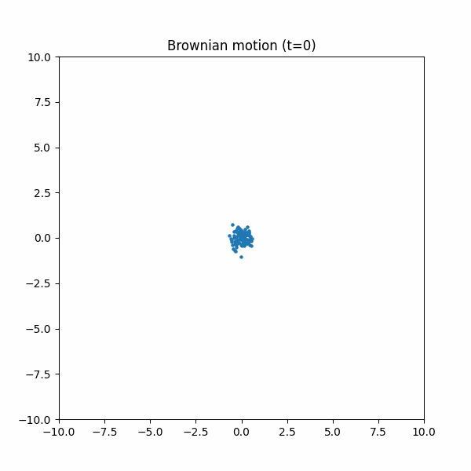

# An Intuitive Study of Denoising Diffusion Probabilistic Models 

---

## Introduction:
**Denoising Diffusion Probabilistic Models (DDPMs)** are models that deal with generation of new data from noise (for examples , if trained on images of handwritten digits it can be used to generate entirely new images of hand written digits). 

It does this by gradually ***corrupting*** an image by adding **gaussian noise** to it. Over many timesteps , the image now losses all the information it once carried with it (things like , what it is? , where is it? etc.). What remains is a pure gaussian noise with mean = 0 and standard deviation = $\I$ . The model then is trained to predict what noise was added at each timestep and reverse the change. After many training runs the model , in a way learns to walk towards a clean image from pure noise. 

A demonstration of the forward diffusion process 

---
### Motivation From Physical Diffusion:
Imagine you drop a little bit of ink into a glass of water. In the beginning, the ink is clearly visible — you can see its shape and where it is concentrated. But slowly, as time passes, the ink starts spreading out in the water. Eventually, it spreads so much that the whole water becomes evenly coloured, and you can no longer tell where the ink originally was.

This whole spreading process is called diffusion.

If we look at it on a microscopic level, the water molecules and ink molecules are constantly moving randomly because of heat energy. This random motion is called Brownian motion. The molecules keep colliding with each other again and again in unpredictable directions.

Even though each individual collision looks random, when you combine the effect of millions of such collisions over time, the overall behaviour can be modeled using Gaussian noise. That is why the ink gradually loses its structure and becomes uniformly spread throughout the water.

A demonstration of Brownian Motion:

Strictly speaking, reversing diffusion exactly is impossible because the process destroys information. But we can train a model to learn the reverse transition probabilities, i.e., the most likely direction that converts noisy data back into clean data step by step.

# Detailed Working :

### Forward diffusion 

Start with a clean image , x0 at each timestep we add gaussian noise epsilon to the image . Here is how the image is transformed at the timestep t from t=0

\[
\alpha_t = 1-\beta_t
\qquad
\bar{\alpha}_t = \prod_{k=1}^t \alpha_k
\]

\[
x_t = \sqrt{\bar{\alpha}_t}x_0 + \sqrt{1-\bar{\alpha}_t}\epsilon
\]

\[
q(x_t|x_{t-1}) = \mathcal{N}(x_t;\sqrt{\alpha_t}x_{t-1}, (1-\alpha_t)I)
\]

the betas are the elements of the noise sequence , (which we decide before ). For example a linear noise schedule or cosine noise schedule. 

Here $q(x_t | x_{t-1})$ represents the conditional probability of the image $x_t$ given $x_{t-1}$ . I like to think of images as a single point in a very very large dimensional space (though 3d is the max I can visualise). Imagine these points following a gaussian distribution centered at $\sqrt{1 - \beta_t}x_{t-1}$ and variance $\beta_t \mathbf{I}$ . As beta generally increases in the noise schedule the mean and the variance approach 0 and $\mathbf{I}$ 

#### Reparameterisation trick
The reparameterization trick is a clever mathematical maneuver used to make a random sampling process differentiable. Lets understand this with an example , say you have 

$$z = Sample(\mathcal{N}(\mu , 1))$$   you are sampling (picking a random value , the ones closer to the mean are more likely to be picked than the ones far away).

And now for back-propagation you require 
$$\frac{\partial z}{\partial \mu}$$  

Just try to think , can you in any way tell what would happen to z (increase slightly or decrease slightly , if either then how much?)?. 

Well , to be honest I can't exactly say whether z would increase or decrease. The whole essence of differential calculus is to find out how one thing behaves when a small change is made in another thing. Here we can't differentiate z wrt $\mu$. 

Hence instead of sampling from the gaussian directly for z , we represent z as 
$$z = \mu + \epsilon  \sigma$$ 

where $\epsilon$ is $$\mathcal{N}(0 , 1)$$

such that z becomes differentiable with respect to $\mu$ and $\sigma$ and hence gradient can flow through the sampling layer 

### Training Objectives 

* first take a clean image from your dataset . Then pick a random value of t (timestep) from (0, T)
  

* Find the corrupted image at timestep t , by using 
\[
x_t = \sqrt{\bar{\alpha}_t}x_0 + \sqrt{1-\bar{\alpha}_t}\epsilon
\]
  We want to make sure that the model is able to denoise an image effectivly from any time step (basically we want the model to be capable of denoising both light and heavy noise)

* We feed both ($x_{t}$ and t) to the model (typically a UNET) to predict $\epsilon$ 

* We try to minmise the negative log likelihood $p_\theta(x0)$ (the prob. that our model produces a real image). Since $log(p_\theta(x0))$ >= ELBO (Evidence lower bound) , we try to maximise the elbo instead as log($p_\theta(x0)$) can't be calulated exactly. 

Maximising the elbo leads to minimising the Mean Sqaured Error between the true noise added and the predicted noise ($\epsilon_{\theta}$) estimate given by the model.

# Some generated Images

Here are two gifs of a images generated from pure gaussian noise by a pretrained DDPM from Hugging Face trained on celebA dataset. Link : https://huggingface.co/google/ddpm-ema-celebahq-256

  
  
  

